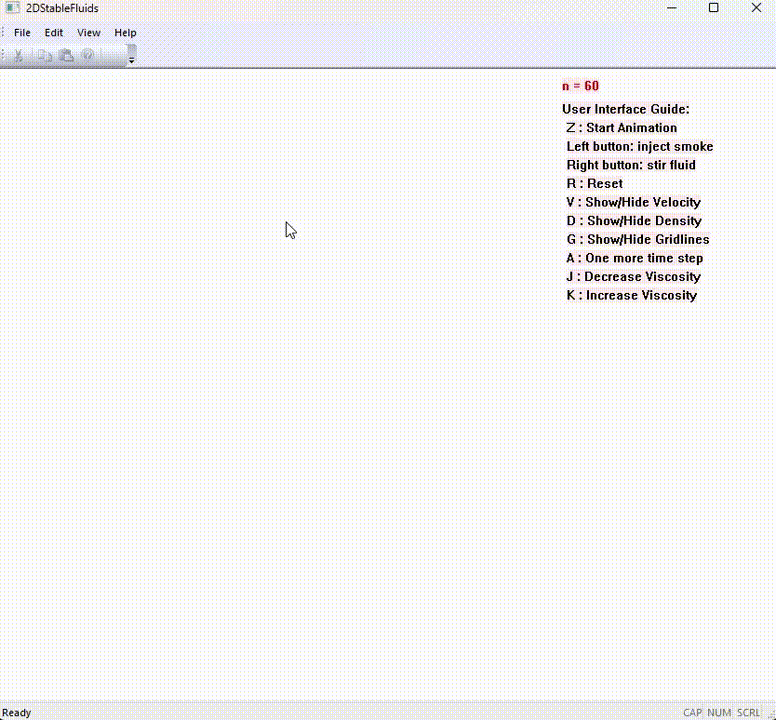
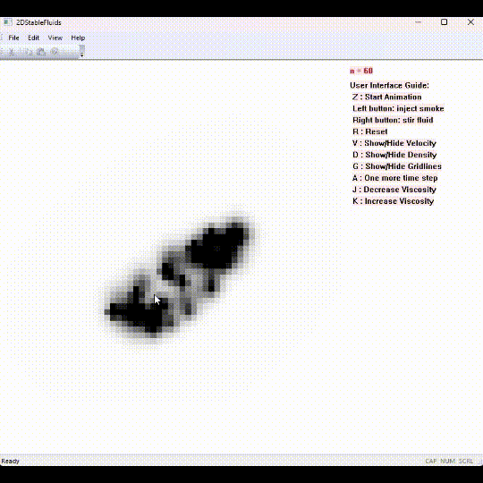

## 2D Fluid Simulation (C++ / MFC)

This project visualizes real-time 2D fluid flow using a simplified Navier–Stokes solver.  
It was developed as my final project of my computer graphics course using Microsoft Foundation Classes (MFC*) in Visual Studio.

### Overview
- Implements a 2D grid-based solver inspired by Jos Stam’s “Stable Fluids”.
- Visualizes density, velocity, and diffusion interactively.
- Users can add play with and see how stable fluids react to external stimuli. 
- Adjustable parameters for viscosity and diffusion.
---
### Regular FLuid with Medium Viscosity

### Regular FLuid with High Viscosity

### Velocity Lines for fluid

---
### Tech Stack
- C++ for all simulation and math logic  
- MFC (Microsoft Foundation Classes) for GUI   
---
### Features
- Real-time simulation at interactive frame rates
- Adjustable viscosity and diffusion constants
- Interactive dye injection and force application
- Visual Studio-style toolbars and menus
---
### Building Instructions
1. Open `FluidSimulation.sln` in Visual Studio 2022 (or later).
2. Make sure MFC is installed (Visual Studio Installer → Individual Components → “MFC and ATL support”).
3. Build and run.
---
### Notes
- This is a **Windows-only** application (depends on MFC).
- The fluid simulation logic (`FluidSolver.cpp`) is independent of the GUI and could be ported to another framework.
- Original project developed in April 2024.
- May have version dependencies not mentioned above.

---
